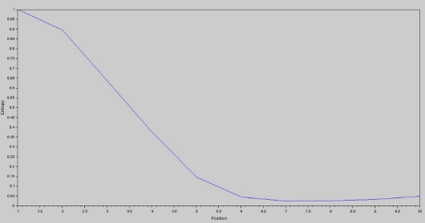
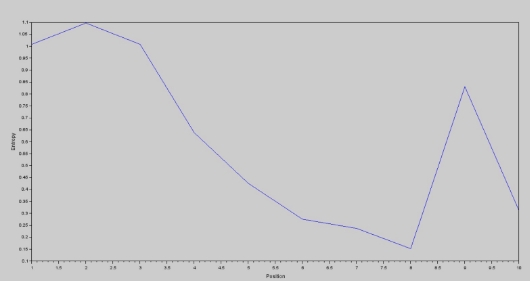
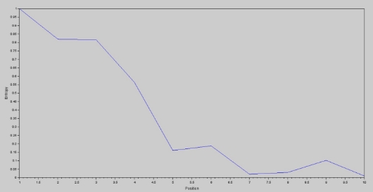

# Gene-Promoter-Discovery
This repo consists of genomic signal processing codes written in scilab. These codes analyzes genome data of Salmonella Enterica. And promoters are discovered with using the statistical alignment method.  

Introduction

This report analyses the genes and promoters of the bacterium Salmonella Enterica. The accession NZ CP053581.1 is used for the initial calculations and 14 other accessions were used for further analysis.

1 Proportion of neglected genes

In this study, full genome data were acquired as a through a fasta le and, information about individual genes were acquired through protein table. Protein table contains all the information about genes and their positions.

To avoid overlapping situation of genes and to avoid mutated genes some genes were neglected.

1. Some genes were neglected for being less than 50 bases downstream of the next gene.
1. Some genes were neglected because they don't have "ATG" or "GTG" as the start codon. (Bacteria Genes should start with "ATG" or "GTG")

Following table gives information about neglected genes in each strand through above two criteria. Number of valid genes are also mentioned.

Table 1: Obtaining Valid Genes

|Sense Strand|Antisense Strand|Total Genome|
| - | - | - |
|#|.%|#|.%|#|.%|
|Genes - According to Protein table|1967|100.00%|2155|100.00%|4122|100.00%|
|
Neglected Genes (being less

than 50 bases upstream of next one)
|656|33.35%|787|36.51%|1443|35.00%|
|Neglected Genes (not having 'ATG' or 'GTG' as start codon)|73|3.71%|86|3.99%|159|3.85%|
|Valid Genes|1238|62.93%|1282|59.48%|2520|61.13%|
1. Position Frequency Matrix

W matching local search was used on valid genes to locate pribnow box promoter within upstream positions 5 to 30 in each sequence. 1000 valid genes in sense strand contributed to the PPM for Pribnow box.

Table 2: Pribnow box Position Frequency Matrix

|1|2|3|4|5|6|7|8|9|10|
| - | - | - | - | - | - | - | - | - | - |
|A|492.01|459.01|454.01|452.01|364.01|325.01|328.01|316.01|300.01|302.01|
|C|0.01|12.01|48.01|91.01|174.01|221.01|207.01|190.01|168.01|160.01|
|G|0.01|3.01|23.01|67.01|112.01|165.01|221.01|270.01|288.01|318.01|
|T|508.01|526.01|475.01|390.01|350.01|289.01|244.01|224.01|244.01|220.01|
2. Position Probability Matrix

Position Probability Matrix (PPM) was obtained by dividing each element in Position frequency matrix by 1000.

Table 3: Pribnow box Position Probability Matrix

|1|2|3|4|5|6|7|8|9|10|
| - | - | - | - | - | - | - | - | - | - |
|A|0.492|0.459|0.454|0.452|0.364|0.325|0.328|0.316|0.300|0.302|
|C|0.00001|0.012|0.048|0.091|0.174|0.221|0.207|0.190|0.168|0.160|
|G|0.00001|0.003|0.023|0.067|0.112|0.165|0.221|0.270|0.288|0.318|
|T|0.508|0.526|0.475|0.390|0.350|0.289|0.244|0.224|0.244|0.220|
Pribnow Box PPM contains 10 positions. Pribnow Sequence = "TATAAT"

Values are rounded up to 3 decimal place here. But original values were used for calculations. Most probable bases are highlighted.

Consensus = "AAATTTTTTG" Consensus score = -9.609337

1. Entropy Measure

Entropy for each position is calculated to measure the amount of information in each column.

Positions with low amount of information (Positions with low entropy value) can be neglected and eliminated to obtain better results. Otherwise those positions can negatively aect on other valuable informations given by other columns.

Table 4: Entropy

|1|2|3|4|5|6|7|8|9|10|
| - | - | - | - | - | - | - | - | - | - |
|Entropy|0.999|0.894|0.637|0.376|0.146|0.045|0.024|0.026|0.032|0.049|

Figure 1: Entropy vs Position

Position 7 and 8 have the lowest entropy values hence lowest information. They can be neglected by using following entropy threshold.

Suitable Entropy Threshold = 0.027

2. Reduced PPM for Pribnow Box

Reduced Pribnow box PPM is as follows,

Table 5: Reduced PPM

|1|2|3|4|5|6|7|8|9|10|
| - | - | - | - | - | - | - | - | - | - |
|A|0.492|0.459|0.454|0.452|0.364|0.325|X|X|0.300|0.302|
|C|0.00001|0.012|0.048|0.091|0.174|0.221|X|X|0.168|0.160|
|G|0.00001|0.003|0.023|0.067|0.112|0.165|X|X|0.288|0.318|
|T|0.508|0.526|0.475|0.390|0.350|0.289|X|X|0.244|0.220|
Reduced Consensus score = -7.342565

4 Statistical Alignment

In the accession NZ CP053581 of Salmonella Enterica,

Genes in sense strand - 1967 Genes in antisense strand - 2155 Valid Genes in sense strand - 1238 Valid Genes in antisense strand - 1282

Out of the above valid genes in sense strand 1000 were used to PPM. Then there are 238 genes from sense strand and 1282 genes (total = 1520) from antisense strand to test statistical alignment.

Threshold value checks whether alignments scores are closer enough to the consensus score to detect the existence of a promoter. Lower the threshold it tends to detect more and more promoters.

Used entropy threshold = 0.027000 Consensus = "AAATTTTTTG" Consensus score = -9.609337 Reduced Consensus score = -7.342565

Table 6: Genes with detectable Promoters

|Threshold|-1|-2|-3|-4|-5|
| - | - | - | - | - | - |
|- Genes in test set|1520|1520|1520|1520|1520|
|Promoters detected|Count|390|909|1201|1377|1454|
|(Original PPM)|.%|25.65%|59.80%|79.01%|90.59%|95.65%|
|Promoters detected|Count|713|1056|1305|1426|1480|
|(Reduced PPM)|.%|46.90%|69.47%|85.85%|93.81%|97.36%|
When comparing the results of Original PPM and the Reduced PPM, reduced PPM has achieved higher percentages. Reduced PPM detects several more sequences as regions with pribnow pro- moters. It is due to the rejection of positions with low information.

1. Using a PPM made with 10 samples

10 Genes from sense strand were taken randomly for this.

Position Frequency Matrix

Table 7: Pribnow Position Frequency Matrix (sample size = 10)

|1|2|3|4|5|6|7|8|9|10|
| - | - | - | - | - | - | - | - | - | - |
|A|6.01|3.01|4.01|7.01|6.01|4.01|1.01|3.01|7.01|5.01|
|C|0.01|0.01|0.01|1.01|1.01|4.01|2.01|1.01|0.01|1.01|
|G|0.01|0.01|0.01|1.01|1.01|1.01|5.01|2.01|2.01|3.01|
|T|4.01|7.01|6.01|1.01|2.01|1.01|2.01|4.01|1.01|1.01|
Position Probability Matrix

Table 8: Pribnow Box PPM for 10 samples

|1|2|3|4|5|6|7|8|9|10|
| - | - | - | - | - | - | - | - | - | - |
|A|0.598|0.299|0.399|0.698|0.598|0.399|0.1005|0.299|0.698|0.499|
|C|0.0009|0.0009|0.0009|0.1005|0.1005|0.399|0.2001|0.1005|0.0009|0.1005|
|G|0.0009|0.0009|0.0009|0.1005|0.1005|0.1005|0.499|0.2001|0.2001|0.299|
|T|0.399|0.698|0.598|0.1005|0.2001|0.1005|0.2001|0.399|0.1005|0.1005|
Values are rounded up to 3 decimal place here. But original values were used for calculations. Consensus = "ATTAAAGTAA" Consensus score = -5.843029

Entropy Measure

Table 9: Entropy (sample size = 100)

|1|2|3|4|5|6|7|8|9|10|
| - | - | - | - | - | - | - | - | - | - |
|Entropy|1.008|1.097|1.008|0.638|0.425|0.275|0.237|0.152|0.830|0.311|
Suitable Entropy Threshold = 0.20

Reduced PPM

Table 10: Pribnow Box PPM for 10 samples

|1|2|3|4|5|6|7|8|9|10|
| - | - | - | - | - | - | - | - | - | - |
|A|0.598|0.299|0.399|0.698|0.598|0.399|0.1005|X|0.698|0.499|
|C|0.0009|0.0009|0.0009|0.1005|0.1005|0.399|0.2001|X|0.0009|0.1005|
|G|0.0009|0.0009|0.0009|0.1005|0.1005|0.1005|0.499|X|0.2001|0.299|
|T|0.399|0.698|0.598|0.1005|0.2001|0.1005|0.2001|X|0.1005|0.1005|
Reduced Concensus score = -4.925244

Figure 2: Entropy vs Position(Sample size = 10)

Statistical Alignment

Used entropy threshold = 0.2 Consensus score = -5.843029 Reduced Consensus score = -4.925244

Table 11: Genes with detectable Promoters (sample size = 10)

|Threshold|-1|-2|-3|-4|-5|
| - | - | - | - | - | - |
|- Genes in test set|1520|1520|1520|1520|1520|
|Promoters detected|Count|5|28|120|302|560|
|(Original PPM)|.%|0.32%|1.84%|7.89%|19.86%|36.84%|
|Promoters detected|Count|17|61|198|447|697|
|(Reduced PPM)|.%|1.11%|4.01%|13.02%|29.40%|45.85%|
2. Using a PPM made with 100 samples

100 Genes from sense strand were taken randomly for this.

Position Frequency Matrix

Table 12: Pribnow Position Frequency Matrix (sample size = 100)

|1|2|3|4|5|6|7|8|9|10|
| - | - | - | - | - | - | - | - | - | - |
|A|53.01|42.01|43.01|46.01|36.01|40.01|31.01|33.01|38.01|29.01|
|C|0.01|2.01|2.01|5.01|15.01|25.01|27.01|19.01|12.01|26.01|
|G|0.01|1.01|1.01|4.01|12.01|7.01|21.01|22.01|25.01|24.01|
|T|47.01|55.01|54.01|45.01|37.01|28.01|21.01|26.01|25.01|21.01|
Position Probability Matrix

Values are rounded up to 3 decimal place here. But original values were used for calculations. Consensus score = -9.022750

Table 13: Pribnow Box PPM (sample size = 100)

|1|2|3|4|5|6|7|8|9|10|
| - | - | - | - | - | - | - | - | - | - |
|A|0.529|0.419|0.429|0.459|0.359|0.399|0.309|0.329|0.379|0.289|
|C|0.0001|0.020|0.020|0.050|0.150|0.25|0.269|0.190|0.120|0.259|
|G|0.0001|0.010|0.010|0.040|0.120|0.070|0.210|0.220|0.25|0.240|
|T|0.469|0.549|0.539|0.449|0.369|0.279|0.210|0.259|0.25|0.210|
Entropy Measure

Table 14: Entropy (sample size = 100)

|1|2|3|4|5|6|7|8|9|10|
| - | - | - | - | - | - | - | - | - | - |
|Entropy|0.999|0.819|0.816|0.563|0.160|0.188|0.020|0.031|0.102|0.0098|

Figure 3: Entropy vs Position(Sample size = 100)

Suitable Entropy Threshold = 0.05

Reduced PPM

Table 15: Reduced Pribnow Box PPM (sample size = 100)

|1|2|3|4|5|6|7|8|9|10|
| - | - | - | - | - | - | - | - | - | - |
|A|0.529|0.419|0.429|0.459|0.359|0.399|X|X|0.379|X|
|C|0.0001|0.020|0.020|0.050|0.150|0.25|X|X|0.120|X|
|G|0.0001|0.010|0.010|0.040|0.120|0.070|X|X|0.25|X|
|T|0.469|0.549|0.539|0.449|0.369|0.279|X|X|0.25|X|
Reduced Concensus score = -5.504800

Statistical Alignment

Used entropy threshold = 0.05 Consensus score = -9.022750 Reduced Consensus score = -5.504800

Table 16: Genes with detectable Promoters (sample size = 100)

|Threshold|-1|-2|-3|-4|-5|
| - | - | - | - | - | - |
|- Genes in test set|1520|1520|1520|1520|1520|
|Promoters detected|Count|165|687|983|1169|1328|
|(Original PPM)|.%|10.85%|45.19%|64.67%|76.90%|87.36%|
|Promoters detected|Count|546|912|1109|1280|1425|
|(Reduced PPM)|.%|35.92%|60.00%|72.96%|84.21%|93.75%|
Comparing results on three sample sizes

Table 17: Comparison over dierent sample sizes

|Thresholds|
| - |
|Sample size|-1|-2|-3|-4|-5|
|Genes without Promoters (Original PPM)|10 100 1000|0.32% 10.85% 25.65%|1.84% 45.19% 59.80%|7.89% 64.67% 79.01%|19.86% 76.90% 90.59%|36.84% 87.36% 95.65%|
|Genes without promoters (Reduced PPM)|10 100 1000|1.11% 35.92% 46.90%|4.01% 60.00% 69.47%|13.02% 72.96% 85.85%|29.40% 84.21% 93.81%|45.85% 93.75% 97.36%|
The same set of samples were used as the test set for all three calculations.

When observing the results it is clear that using a large set of samples, manages to detect more promoters.

The PPM created by 10 samples performs really poor in detecting promoters. When there are 4 possible bases for each positions using 10 samples isn't enough to create generalized probability matrix for statistical calculations.

The PPM created by 100 samples performs really well with respect to the previous situation. It performs well but still slightly lower than 1000 samples PPM. It seems 100 samples can generalize the PPM more.

The PPM created by 1000 samples performs the best. It has enough data to create well generalized PPM. But when considering the computational expenses, it hasn't gained a lot when comparing with the 100 samples PPM.

6 Statistical Alignment on other genome accessions

The reduced pribnow box PPM in (3) is used to perform statistical alignment for 14 genomes of Salmonella Enterica. They are mentioned in the rst row with accession number. Each white box contains the percentage of detectable promoters in each genome.

Table 18: Percentage of detectable promoters in each genome

|Accession|
Thresholds

-3

-5

-4

-2

-1
|
| - | - |
|NZ CP066047.1|49.01%|71.56%|86.99%|93.92%|97.15%|
|NZ CP028172.1|47.97%|71.28%|86.93%|94.03%|97.21%|
|NZ CP030194.1|47.42%|71.31%|87.26%|94.68%|97.44%|
|NZ CP030231.1|48.72%|72.08%|87.13%|94.12%|97.29%|
|NZ CP030238.1|47.96%|72.28%|87.73%|94.92%|97.88%|
|NZ CP037891.1|48.42%|71.98%|87.21%|94.31%|97.35%|
|NZ CP040380.1|47.65%|71.54%|87.42%|94.28%|97.46%|
|NZ CP046277.1|47.97%|71.63%|87.22%|94.53%|97.32%|
|NZ CP046279.1|48.60%|71.79%|87.45%|94.34%|97.25%|
|NZ CP046280.1|48.05%|71.99%|87.23%|94.09%|97.24%|
|NZ CP046291.1|48.57%|71.58%|87.51%|94.63%|97.45%|
|NZ CP053581.1|49.08%|72.46%|88.17%|94.88%|98.09%|
|NZ CP060508.1|48.43%|72.09%|87.24%|94.23%|97.17%|
|NZ CP069518.1|48.21%|72.28%|87.36%|94.22%|97.28%|
|NZ CP075108.1|48.03%|71.13%|86.42%|93.89%|96.96%|
According to the results, it can be concluded that the generated PPM is a well generalized PPM that works equally on every dierent accession. But there is a slight improvement of percentages when it comes to the "NZ CP053581.1" acccession which is highlighted. It is the accession used to create the PPM. Training set always gives high accuracy than test sets. But the dierence is insignicant and it can be concluded that the PPM created in 3, is well generalized and can be used on other datasets for statistical alignment.

Summary of Base Distribution in NZCP053581.1

Total Number of A bases: 2242009 Total Number of C bases: 2424532 Total Number of G bases: 2418156 Total Number of T bases: 22484

Total Number of bases: 9333110 Total Number of base pairs: 4666555
PAGE9
